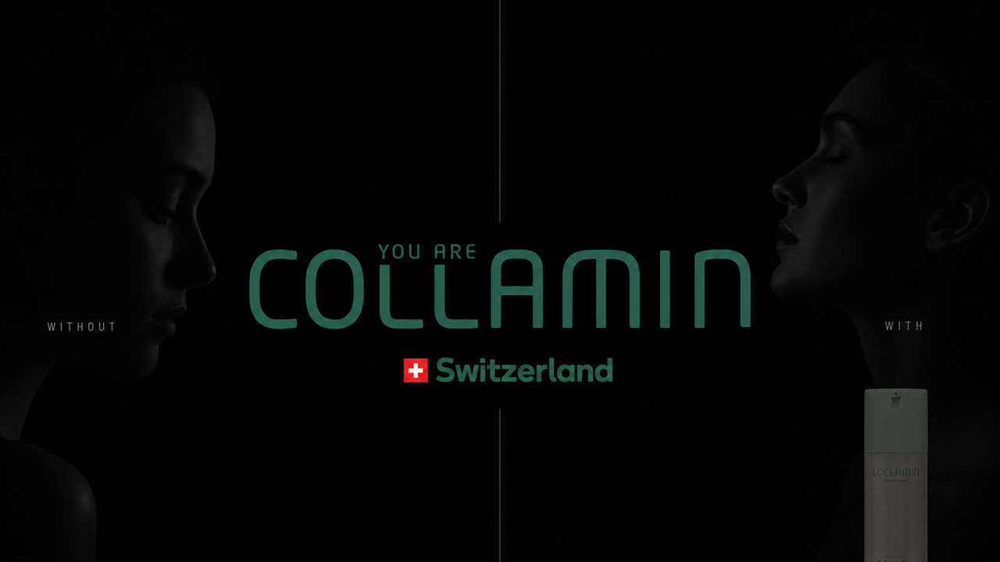

<p align="center">
  
</p>

<p align="center">
  
</p>

<div align="center">

# Collamin · shelf-talker

Seylane · TypeScript · Next.js 14

One portrait. Two futures. Twenty years.

`seylane` · `collamin` · `shelf-talker` · `nextjs` · `typescript` · `google-gemini` · `skincare` · `rtl` · `persian`

</div>

---

## About

Campaign shelf-talker for **Collamin**. A guest uploads a vertical portrait. The App Router posts it to `POST /api/generate`, which calls Gemini (`gemini-3-pro-image-preview`) twice on the same face:

- **Without** — +20 years, natural aging, no consistent skincare
- **With** — the same +20 years, skin maintained with Collamin

Identity, pose, crop, and lighting stay locked. The Node route then composes a **1080×1920** story still (Without over With, Poppins labels, logo on the lower half). The Persian RTL surface is a comparison slider, a download of all three stills, and Web Share for Stories (`collamin.iran`).

**GitHub About** for this repository (name unchanged):

> Seylane shelf-talker for Collamin. Next.js 14 / TypeScript. Portrait in → Gemini +20-year with/without Collamin → 1080×1920 story split. Persian RTL.

**Topics:** `seylane` `collamin` `shelf-talker` `nextjs` `typescript` `google-gemini` `image-generation` `skincare` `rtl` `persian`

## Surface

| Path | Role |
| --- | --- |
| `/` | Portrait upload, generate, comparison slider, download, story share |
| `/stats` | Hidden usage counter — successes, failures, story stills, average time |
| `POST /api/generate` | Gemini pair + story compose · `maxDuration` 60s |
| `GET /api/stats` | Counter JSON |
| `GET /api/analytics` | Campaign analytics JSON |
| `GET /api/health` | `{ status: "ok", service: "collamin-shelftalker" }` |

Upload accepts PNG/JPG. The client rejects landscape frames (`height` must exceed `width`). Generation is observed around 20s; the browser aborts at 90s.

## Run

```bash
npm install
```

`/api/generate` requires `GEMINI_API_KEY`. `.env.local.example` also lists `N8N_WEBHOOK_URL` and `NEXT_PUBLIC_SITE_URL` (passed through `next.config.mjs`).

```bash
npm run dev
```

Open `http://localhost:3000`. Usage: `http://localhost:3000/stats`.

## Stack

Next.js 14.1 · React 18.2 · TypeScript 5.3 · Tailwind 3.4 · sharp · node-canvas · `@google/generative-ai`

Story compose registers `public/fonts/Poppins-Bold.ttf` when present. Counters persist to `.next/stats.json`. Story composition is best-effort — a failed compose still returns the two Gemini stills.

## Notes

- Portrait only. Same person, same age on both sides; only skin condition differs.
- Footer tags [collamin.iran](https://www.instagram.com/collamin.iran/).
- Set `GEMINI_API_KEY` on the host that already serves this app.
